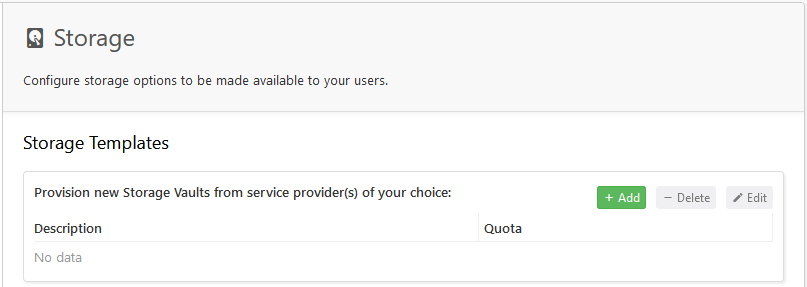

# Access

An Access Grant is a security envelope that contains a satellite address, a restricted API Key, and a restricted path-based encryption key - everything an application needs to locate an object on the network, access that object, and decrypt it.


Learn more about [**Access Management** ](../../concepts/access/)and [**Access Grants**](../../concepts/access/access-grants/) or check out the FAQ on [**Access Grants**](../../support/faqs.md#when-do-you-create-an-access-grant-in-satellite-ui-and-when-do-you-use-the-cli) and [**Encryption Keys**](../../support/faqs.md#how-are-encryption-keys-managed).


The Access Grant screen allows you to create or delete Access Grants, generate credentials for the Storj DCS S3-compatible Gateway from an Access Grant, create an API key to generate an access grant in the CLI.

## Create Access Grant

Let's start with creating an Access Grant. Click the **Create Access Grant** Button.

.png>)

Give your Access Grant a name:

.png>)

Set any access restrictions you want encoded into your Access Grant. Through the Satellite Admin Console, you can set basic restrictions on your Access Grant. You can get [more sophisticated using the CLI](../quickstart-uplink-cli/generate-access-grants-and-tokens/generate-a-token.md) and add [further, more granular restrictions](../../api-reference/uplink-cli/share-command.md), for example, at the path prefix level within a Bucket.

.png>)

Next, enter an [Encryption Passphrase](../../concepts/access/encryption-and-keys/) for your Access Grant. Note that this encryption passphrase is handled by the browser and is not stored by the Satellite. You can either **Generate Passphrase** or **Create My Own Passphrase**.


Do not [lose your Encryption Passphrase](../../support/faqs.md#how-do-i-recover-from-having-lost-my-encryption-key-associated-with-an-access-grant). Storj DCS does not manage your encryption keys and if you lose your Encryption Passphrase and your Access Grant, you will not be able to decrypt your data.


.png>)

Copy or download your Access Grant. Do not lose it, you only have one opportunity to do so. If you did not save it, please delete this Access Grant and create a new one and save it on this time.

.png>)

This Access Grant can now be used to configure tools like the Storj DCS [Uplink CLI](../quickstart-uplink-cli/uploading-your-first-object/set-up-uplink-cli.md), [libuplink library](https://github.com/storj/storj/wiki/Libuplink-Walkthrough), or apps like [Rclone](../../how-tos/sync-files-with-rclone/rclone-with-native-integration.md), [FileZilla ](../../how-tos/set-up-filezilla-for-decentralized-file-transfer.md)or [Restic](../../how-tos/backup-with-restic.md). You can also generate credentials for the Storj DCS S3-compatible Gateway.

## Create S3 Credentials

[You need to have a satellite account and installed Uplink CLI](../quickstart-uplink-cli/prerequisites.md).


Remember, when you generate credentials for the Storj DCS S3-compatible Gateway from an Access Grant, you are [opting in to server-side encryption](../../concepts/encryption-key/design-decision-server-side-encryption.md).


.png>)

When you generate credentials for the Storj DCS S3-compatible Gateway, the Admin Console will create and register your Access Grant with the [Gateway auth service](../../concepts/edge-services/auth-service.md) and display the credentials required to configure your client app to work with the Storj DCS S3-compatible Gateway.



## Create Keys for CLI

1. [You need to have a satellite account and installed Uplink CLI](../quickstart-uplink-cli/prerequisites.md).
2. To start, proceed through the initial steps of creating a new Access Grant.
3. Navigate to [**Access**](access-grants.md) page and click the **Create Keys for CLI** link (rightmost option).

.png>)

4\. Provide name, permissions and optionally buckets, select **Create Keys**.

.png>)

5\. Copy and save the **Satellite Address** and **API Key** in a safe place or download them as they will only appear once.

.png>)

6\. Make sure you've already [downloaded the Uplink CLI](../../downloads/download-uplink-cli.md) and run `uplink setup`.



```
./uplink.exe setup
```



```
uplink setup
```



```
uplink setup
```




For anyone who has previously configured an Uplink, please use a named access. If you want to replace the default access, you need to either [Create an Access Grant](../quickstart-uplink-cli/uploading-your-first-object/create-first-access-grant.md) and use the [`uplink access import`](../../api-reference/uplink-cli/access-command/access-import.md#import-access-grant-and-replace-the-existing-access) command with `--force` flag to import it, or use the [`uplink access create --import-to <name>`](../../api-reference/uplink-cli/access-command/access-create.md#create-an-access-grant-and-replace-the-existing-access) command with `--force` flag to create an Access Grant in CLI and import it to the specified access in the local store of Uplink.


7\. Follow the prompts. When asked for your API Key, enter it (you should have saved it in step 5 above).

8\. Generate the Access Grant by running `uplink share` with no restrictions.


&#x20;If you chose an access name, you'll need to specify it in the following command as `--access=name`




```
./uplink.exe share --readonly=false
```



```
uplink share --readonly=false
```



```
uplink share --readonly=false
```




Keep your full-rights Access Grant secret, it contains the encryption key and will enable uploading, downloading or deleting your data from the entire project!


9\. Your Access Grant should have been output.&#x20;


The alternative for using the `uplink setup` command and then `uplink share` is to use the [`uplink access create`](../../api-reference/uplink-cli/access-command/access-create.md) command instead, it will print the Access Grant right away.


## Delete Access Grant

To Delete an Access Grant, select three dots on the right side of the Access Grant and choose **Delete Access**:

.png>)

Then confirm that you want to delete the Access Grant by typing its name and confirming with **Delete Access** button.

.png>)


**Important:** If you delete an Access Grant from the Satellite user interface, that Access Grant will immediately cease to function, and all hierarchically derived child Access Grants and Storj DCS gateway access credentials based on that Access Grant will also cease to function. Any data uploaded with that Access Grant will persist on Storj DCS. If you didn't back up the Encryption Passphrase used with the Access Grant you are deleting, you will not be able to decrypt that data without that Encryption Passphrase, and it will be effectively unrecoverable.


You don't need to know everything in the whitepaper about our Access Grants, macaroon-based API Keys or our encryption implementation, but if you understand the general principles, you'll find these are some very sophisticated (but easy to use) tools for creating more secure and private applications.

Next we'll cover [adding and removing other developers to and from your project](users.md).
