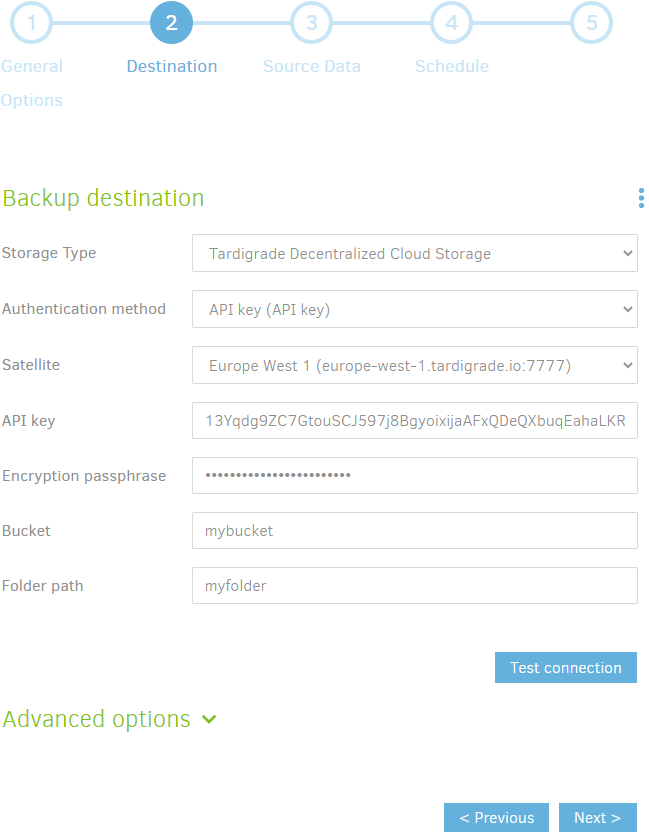
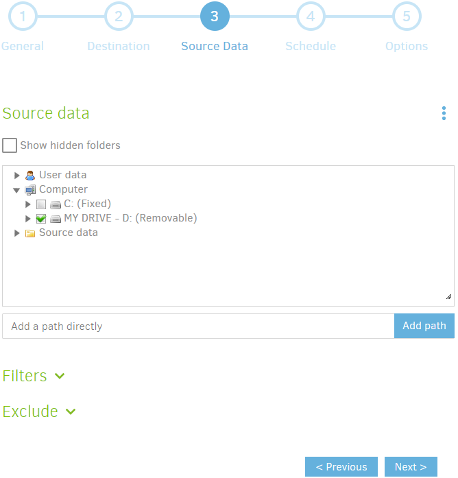
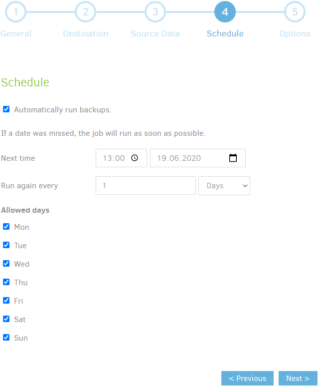
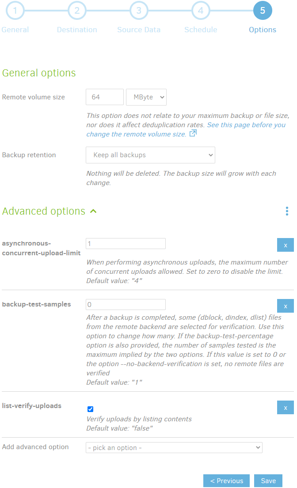
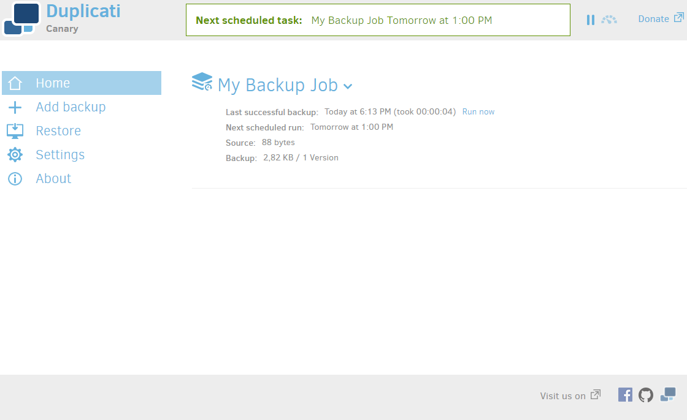

# Backup With Duplicati

## Overview

Duplicati is a backup tool. It can group, dedupe, and compress small files into bigger blocks. It is a great tool for reducing the costs of cold storage. It also supports versioning.

To restore a small file, Duplicati has to download the entire block it is contained in. Therefore, the best fit for Duplicati are the following two backup use cases: \
1\. when none of the files contained in the same block need to be ever restored again in the future. \
2\. when all files in a block need to be restored at the same time.

## Install


**Please note that the version used for writing this documentation is currently not yet released on the Duplicati homepage. Please download the canary version from  **[**https://github.com/duplicati/duplicati/releases**](https://github.com/duplicati/duplicati/releases)** or use the canary **[docker container](https://hub.docker.com/r/duplicati/duplicati).


1. [Download](https://github.com/duplicati/duplicati/releases) and install the Duplicati installer file for your OS or run the [docker container](https://hub.docker.com/r/duplicati/duplicati). Note **warning** above!
2. Once installed, the software will open your browser to the local Duplicati dashboard. If not, it can be accessed at [http://localhost:8200/](http://localhost:8200)

## Setup

1. On the Duplicati dashboard, click "Add Backup" and select "Configure a new backup"

2\. Enter a name for this backup. For this example, we'll call it "My Backup Job." The Storj DCS plugin will encrypt all files before they get uploaded. We don't want to encrypt each file twice. Disable the Duplicati encryption.

.png>)

3\. Click the storage type dropdown and select "Tardigrade Decentralized Cloud Storage." Select a satellite, then enter an [API Key](../getting-started/quickstart-uplink-cli/generate-access-grants-and-tokens/generate-a-token.md) ([Access token](../getting-started/quickstart-uplink-cli/generate-access-grants-and-tokens/generate-a-token.md)), encryption passphrase, bucket and optionally, a folder. You can [generate a new API Key](../getting-started/quickstart-uplink-cli/generate-access-grants-and-tokens/generate-a-token.md) at any time but please don't lose the encryption key - keep a backup in a safe place.

4\. Next, press "Test Connection"

.png>)

5\. On the next page, we will select the folder we want to backup. For this example, we will use "My Drive"

6\. Now we will create a schedule. In this example, we will run the backup once every day at 1:00 PM.

7\. On the next page, select the appropriate options for you.

## Recommended Options

| Option                                 | Description                                                                                                                                                                                                                                                                                                                         |
| -------------------------------------- | ----------------------------------------------------------------------------------------------------------------------------------------------------------------------------------------------------------------------------------------------------------------------------------------------------------------------------------- |
| asynchronous-concurrent-upload-limit=1 | By default, Duplicati will transfer 4 files in parallel in order to speed up the transfer. The Storj protocol splits every file upload into many small pieces and uploads them in parallel. Even with only 1 concurrent upload it should max out most consumer connections.                                                         |
| backup-test-samples=0                  | The Storj protocol checks the hash at the end of every file upload. An additional test sample is not needed. Use list-verify-uploads instead.                                                                                                                                                                                       |
| list-verify-uploads=true               | If a file upload fails for any reason, a final listing would catch it.                                                                                                                                                                                                                                                              |
| no-auto-compact=true                   | If a large number of small files are detected during a backup, or wasted space is found after deleting backups, the remote data will be compacted. This will cause a lot of unnecessary and expensive download traffic.                                                                                                             |
|  threshold                             | As files are changed, some data stored at the remote destination may not be required. This option controls how much wasted space the destination can contain before being reclaimed. Depending on the use case, the threshold can be reduced to 0. Storj DCS doesn't charge you for the additional delete and re-upload operations. |
| zip-compression-method                 | This option can be used to set an alternative compression method, such as LZMA.                                                                                                                                                                                                                                                     |

8\. Click "Save" and you should see the "My Backup Job" we created on the Duplicati homepage.

9\. You can select "Run now" if you would like to do a backup instantly.

Congrats, you've set up Duplicati Backup to Storj DCS! 🎉
