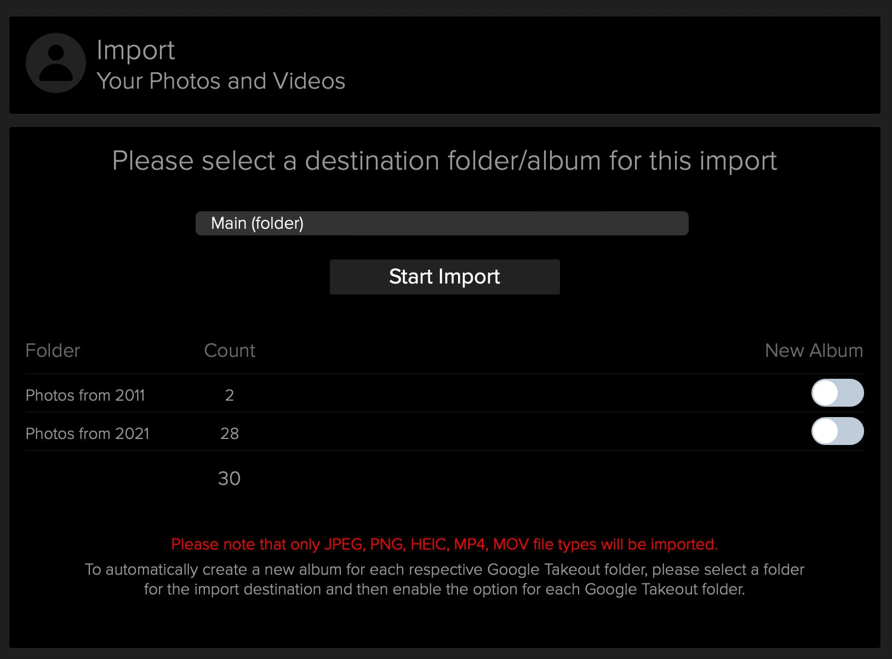

# Comet Backup Integration Guide

### Introduction

Whether you’re looking for cloud backup, computer backup or data backup, [Comet](https://cometbackup.com/) provides solutions to protect and restore partitions, databases, servers, files and folders. We support Windows, MacOS and Linux backup.

Comet scales with your business. Provide backup on your terms. No contracts. Free replication, free support and free white labeling, rebrand the software with your logo. Comet’s intuitive, all-in-one platform lightens the workload for your team.

Main site: [https://cometbackup.com/](https://cometbackup.com/) - You can download a free trial [here](https://cometbackup.com/signup).

### Storj with Comet Backup

Using Storj with Comet Backup provides resilient cloud object storage with blazing performance and zero-trust security.

1. **Speed of recovery**: CDN-like performance at cold storage prices for instant recovery of your backup data
2. **Durability**: long term, your data is never going away
3. **Security**: Ransomware resistant with end to end encryption

### Before you begin&#x20;

If you do not currently have a Comet Server, please refer to Comet’s [getting started guide](https://docs.cometbackup.com/latest/). Storj functionality is available on Comet Server version 22.9.0 and above.&#x20;

## Storj setup

To begin setting up Comet with Storj, you'll need to first create an account on Storj.

Navigate to [https://storj.io/signup](https://storj.io/signup) or login to an existing Storj account.\
.png>)

### Create a Storj Bucket

&#x20;You need to create a Storj bucket for Comet to create Storage Vaults in.&#x20;

1. Navigate to “Buckets” on the left side menu
2. Click “New Bucket” on the top right\
   .png>)
3. Name the bucket something identifiable such as “comet-backups”\
   \
   .png>)
4. Select "Continue"
5. Generate a passphrase or enter your own.\
   \
   .png>)
6. Select "Continue"
7. Record the passphrase somewhere safe.


Remember your passphrase as you will need it for future access of your data. Storj is unable to recover your passphrase for you.


### Create Storj Access Key

You will need to configure a Storj access key for Comet to be able to create Storage Vaults.&#x20;

To create an API Access key in the Storj web console:

1. Navigate to "Access" on the left side menu
2. Click "Create Keys for CLI" under the API key block\
   
3. **Type:** API Access
4. **Name:** The name of the access key (e.g. Comet)
5. **Permissions:** All
6. **Buckets:** Feel free to specify the bucket created above (e.g. comet-backups), or leave as “All”\
   \
   .png>)
7. Click “Create Keys” and record the API key somewhere safe.

## Comet setup

### Configuring a Storj Storage Template

1. Navigate to your Comet Server settings and find the Storage Templates section
   1. &#x20;For Comet-Hosted “Settings -> Storage -> Storage Templates”
   2. For Self-Hosted “Settings -> Authentication -> Storage Templates”
2. Click the green “Add” button to add a new Storage Template.\
   \
   
3. Change the “Type” to Storj DCS and then fill in the fields
   1. **Description:** What the storage will be called on the Comet Server
   2. **Satellites:** The location of the Storj satellite server. You can locate which satellite you're using by looking at the url of the Storj web console. \
      
   3. **API Key**: The API key created in [#create-storj-access-key](cometbackup-integration-guide.md#create-storj-access-key "mention")
   4. **Passphrase**: The passphrase created in [#create-a-storj-bucket](cometbackup-integration-guide.md#create-a-storj-bucket "mention")
   5. **Bucket**: The name of the bucket created in [#create-a-storj-bucket](cometbackup-integration-guide.md#create-a-storj-bucket "mention")\
      \
      .png>)
4. Once complete you should now see Storj as an option in the Storage Templates section in your Comet Server.\
   
5. You will now be able to request a new Storj Storage Vault for a user.\
   \
   .png>)

You will also be able to request a Storj Storage Vault when you add new users.

