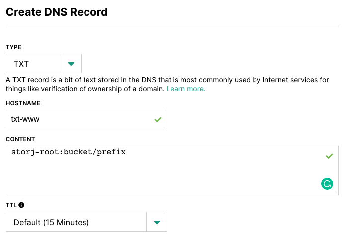
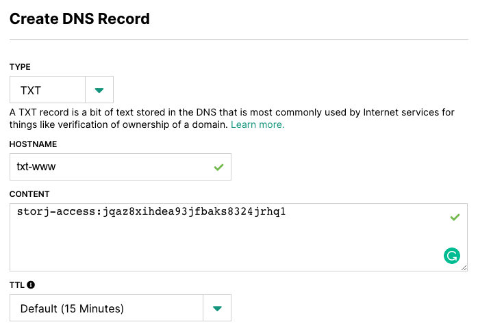

# Host a Static Website with the Uplink CLI and Linksharing Service

You can use your own domain name and host your own static website on Storj DCS with the following setup.


**Static websites** serve files, including HTML, CSS, and Javascript files, exactly as they are stored on the server. All visitors will be served the same files.

**Dynamic websites** use server-side processing to generate the underlying code behind each page. They support Create, Read, Update, Delete operations against a database. Web views can be custom rendered to each user.


## Part 1: Uplink CLI

1. Download the [Uplink Binary](../../getting-started/quickstart-uplink-cli/uploading-your-first-object/set-up-uplink-cli.md) and upload your static site files to Storj DCS. You may also upload your files in any other manner, but you will need the Uplink CLI for the remaining steps.
2. Share the bucket or object prefix (not individual objects) that will be the root of your website/subdomain. At the root, name your home page`index.html`. The website will serve the index.html file automatically  e.g.`http://www.example.test` and `http://www.example.test/index.html`will serve the same content. Anything shared with `--dns` will be _readonly_ and available _publicly_ (no secret key needed). You can optionally specify your preferred linkshare region with `--base-url`



```
./uplink.exe share --dns <hostname> sj://<bucket>/<prefix> --base-url <linkshare url>
```



```
uplink share --dns <hostname> sj://<bucket>/<prefix> --base-url <linkshare url>
```



```
uplink share --dns <hostname> sj://<bucket>/<prefix> --base-url <linkshare url>
```



Notably, this mechanism allows you to host multiple websites from the same bucket by using different prefixes. You may also create multiple subdomains by using different hostnames (however, the Uplink CLI only generates info for one at a time).

The command above prints a zone file with the information needed to create 3 DNS records. Your CNAME should match the linkshare service region you prefer.&#x20;

| Region | CNAME                  |
| ------ | ---------------------- |
| Asia   | link.ap1.storjshare.io |
| EU     | link.eu1.storjshare.io |
| US     | link.us1.storjshare.io |

```
$ORIGIN example.com.
$TTL    3600
<hostname>    	IN	CNAME	link.<region>.storjshare.io.
txt-<hostname> 	IN	TXT  	storj-root:<bucket>/<prefix>
txt-<hostname> 	IN	TXT  	storj-access:<access key>
```

Remember to update the `$ORIGIN` from `example.com` to your domain name (keep the trailing `.`). You may also change the DNS `$TTL`.

For example, for objects stored on the **us1 satellite**, running

```
uplink share --dns www.example.com sj://bucket/prefix
```

&#x20; will output a zone file like the following:

```
$ORIGIN example.com.
$TTL    3600
www.example.com    	IN	CNAME	link.us1.storjshare.io.
txt-www.example.com	IN	TXT  	storj-root:bucket/prefix
txt-www.example.com	IN	TXT  	storj-access:jqaz8xihdea93jfbaks8324jrhq1
```

## Part 2: DNS Provider

1\. In your DNS provider, create a CNAME record on your hostname using the CNAME from your generated zone file as the target name.&#x20;


Ensure you include the trailing `.` at the end of your CNAME if your DNS providers allows.



2\. Create 2 TXT records, prepending `txt-` to your hostname.

**Root Path:** the bucket or object prefix key that you want your root domain to resolve to (and that contains your index.html file).



&#x20;**Access Key:** the readonly and public access key to your root path.



3\. You can check to make sure your DNS records are ready with `dig @1.1.1.1 txt-<hostname>.<domain> TXT`

4\. Without further action, your site will be served with HTTP. You can secure your site by using an HTTPS proxy server such as [Fastly](https://fastly.com/).

5\. Optionally, if you create a page titled `404.html`in the root of your shared prefix, it will be served in 404 conditions.

6\. That's it! You should be all set to access your website! e.g.`http://www.example.test`
