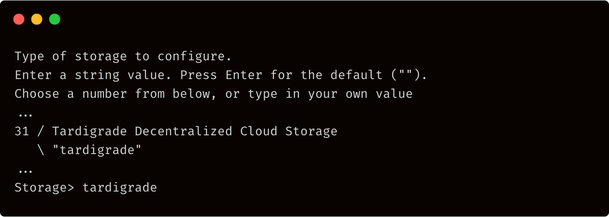
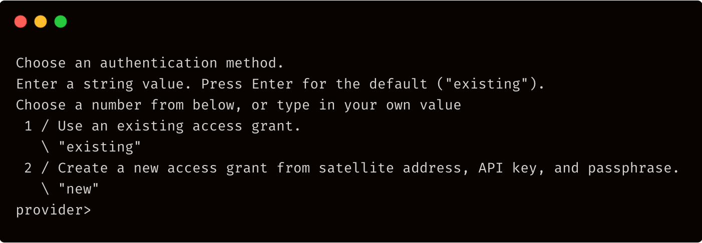
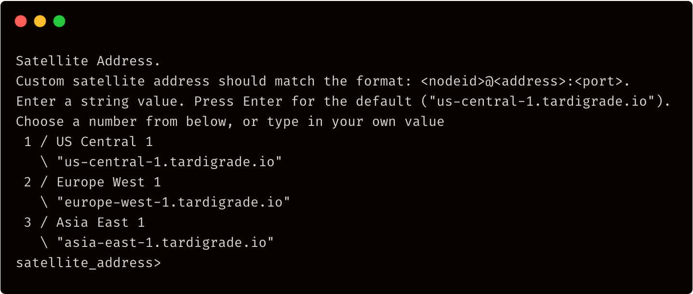
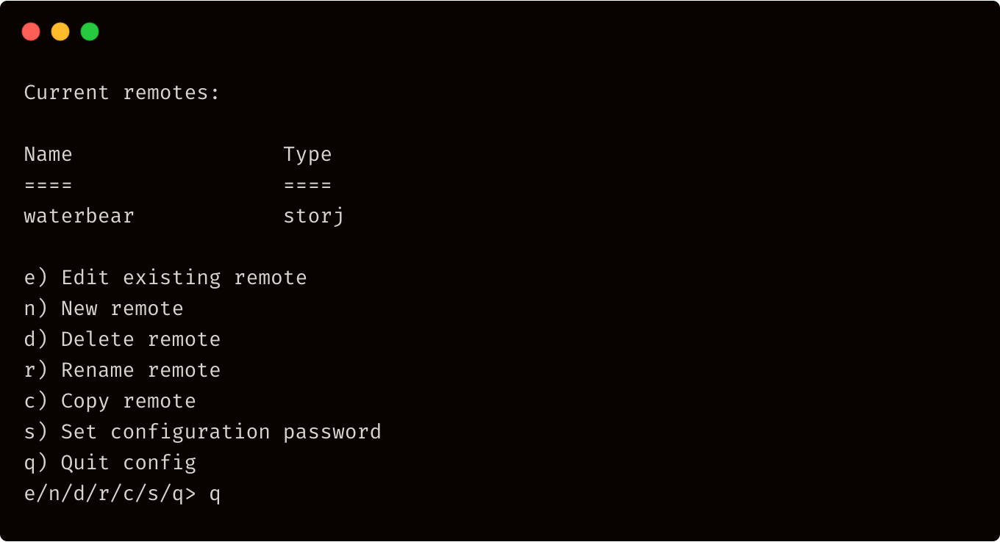

# Rclone with Native Integration

## Selecting an Integration Pattern

Use our native integration pattern to take advantage of client-side encryption as well as to achieve the best possible download performance. Uploads will be erasure-coded locally, thus a 1gb upload will result in 2.68gb of data being uploaded to storage nodes across the network.&#x20;

### Use this pattern for

* The strongest security
* The best download speeds

## Setup

First, [Download](https://rclone.org/downloads/) and extract the rclone binary onto your system.

Execute the config command:

```bash
rclone config
```

A text-based menu will prompt. Type `n` and hit `Enter` to create a new remote configuration.


Enter a name for the new remote configuration, e.g. `waterbear`.


A long list of supported storage backends will prompt. Enter `tardigrade` and hit `Enter`.



Choose your authentication method: existing access grant or new access grant from [API Key](../../getting-started/quickstart-uplink-cli/generate-access-grants-and-tokens/generate-a-token.md) ([Access token](../../getting-started/quickstart-uplink-cli/generate-access-grants-and-tokens/generate-a-token.md)).



If you selected to authenticate with an existing access grant, enter the serialized access grant you have received by someone else.


If you selected to authenticate with a new access grant, first enter the satellite address by selecting one from the list or enter the address of a 3rd-party satellite.




If you enter the a 3rd-party satellite, the address must include also the node ID of the satellite. This is required to establish a secure connection with the satellite.


The second step of creating a new access grant is to enter your [generated token](../../getting-started/quickstart-uplink-cli/generate-access-grants-and-tokens/generate-a-token.md).


The final step of creating a new access grant is to enter your encryption passphrase.



The passphrase is used for encrypting and decrypting the data stored on Storj DCS (formerly known as Tardigrade). If you have any data previously uploaded to this project, you must enter the same passphrase in order to download it successfully.


A summary of the remote configuration will prompt. Type `y`and hit `Enter` to confirm it.


Now you should see one remote configuration available. Enter `q` and hit `Enter` to quit the configuration wizard.




For additional security, you should consider using the (s) option

` Set configuration password` option. It will encrypt the `rclone.conf` configuration file. This way secrets like the [API Key](../../getting-started/quickstart-uplink-cli/generate-access-grants-and-tokens/generate-a-token.md) ([access token](../../getting-started/quickstart-uplink-cli/generate-access-grants-and-tokens/generate-a-token.md)), the encryption passphrase, and the access grant won't be stolen if an attacker get access to your configuration file.


## Create a Bucket

Use the `mkdir` command to create new bucket, e.g. `mybucket`.

```yaml
rclone mkdir waterbear:mybucket
```

## List All Buckets

Use the `lsf` command to list all buckets.

```yaml
rclone lsf waterbear:
```


Note the colon (`:`) character at the end of the command line.


## Delete a Bucket

Use the `rmdir` command to delete an empty bucket.

```yaml
rclone rmdir waterbear:mybucket
```

Use the `purge` command to delete a non-empty bucket with all its content.

```yaml
rclone purge waterbear:mybucket
```

## Upload Objects

Use the `copy` command to upload an object.

```yaml
rclone copy --progress ~/Videos/myvideo.mp4 waterbear:mybucket/videos/
```


The `--progress` flag is for displaying progress information. Remove it if you don't need this information.


Use a folder in the local path to upload all its objects.

```yaml
rclone copy --progress ~/Videos/ waterbear:mybucket/videos/
```


Only modified files will be copied.


## List Objects

Use the `ls` command to list recursively all objects in a bucket.

```yaml
rclone ls waterbear:mybucket
```

Add the folder to the remote path to list recursively all objects in this folder.

```yaml
rclone ls waterbear:mybucket/videos/
```

Use the `lsf` command to list non-recursively all objects in a bucket or a folder.

```yaml
rclone lsf waterbear:mybucket/videos/
```

## Download Objects

Use the `copy` command to download an object.

```yaml
rclone copy --progress waterbear:mybucket/videos/myvideo.mp4 ~/Downloads/
```


The `--progress` flag is for displaying progress information. Remove it if you don't need this information.


Use a folder in the remote path to download all its objects.

```yaml
rclone copy --progress waterbear:mybucket/videos/ ~/Downloads/
```

## Delete Objects

Use the `deletefile` command to delete a single object.

```yaml
rclone deletefile waterbear:mybucket/videos/myvideo.mp4
```

Use the `delete` command to delete all object in a folder.

```yaml
rclone delete waterbear:mybucket/videos/
```

## Print the Total Size of Objects

Use the `size` command to print the total size of objects in a bucket or a folder.

```yaml
rclone size waterbear:mybucket/videos/
```

## Sync Two Locations

Use the `sync` command to sync the source to the destination, changing the destination only. Doesn’t transfer unchanged files, testing by size and modification time or MD5SUM. Destination is updated to match source, including deleting files if necessary.

```yaml
rclone sync --progress ~/Videos/ waterbear:mybucket/videos/
```


The `--progress` flag is for displaying progress information. Remove it if you don't need this information.



Since this can cause data loss, test first with the `--dry-run` flag to see exactly what would be copied and deleted.


The sync can be done also from Storj DCS to the local file system.

```yaml
rclone sync --progress waterbear:mybucket/videos/ ~/Videos/
```

Or between two Storj DCS buckets.

```yaml
rclone sync --progress waterbear-us:mybucket/videos/ waterbear-europe:mybucket/videos/
```

Or even between another cloud storage and Storj DCS.

```yaml
rclone sync --progress s3:mybucket/videos/ waterbear:mybucket/videos/
```

