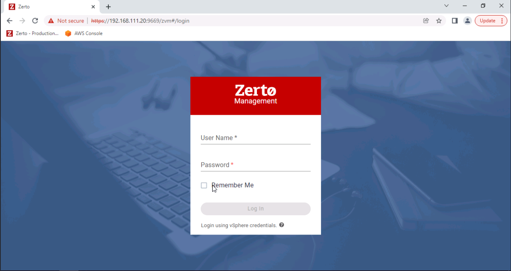

# Zerto Integration Guide

## Introduction

**Zerto** brings together disaster recovery and data protection.  It provides a single, scalable solution provides simple cloud data management and protection across on-premises, hybrid, and multi-cloud environments.  You can use **Zerto** with **Storj DCS** S3-compatible storage.

**Main site**: [https://www.zerto.com](https://www.zerto.com) - You can download a free trial [here](https://www.zerto.com/try-or-buy/try-zerto-free/).

**Demo site**: [Zerto’s Hands on Labs](https://www.zerto.com/page/labs/?z\_campaign=2020\_Google\_Ads\_Training\_Labs\_On\_demand\&z\_content=Labs\&z\_leadsource=Google\_Adwords\&z\_referrer=Adwords\&z\_source=7012I000001hzgP\&gclid=CjwKCAjwj42UBhAAEiwACIhADqQ1Xo-tUPvM5qy8Pe1U2IxOnx-KBzpTQAgevDJYc42LYIXwgLIJTRoCDkUQAvD\_BwE)

## Configure Zerto to use Storj DCS

Log into Zerto Virtual Manager (ZVM).

On the left-hand side of the ZVM dashboard, click the `Setup` button (icon looks like a wrench).

Tab over to `Repositories` and click `New Repository`.

.png>)

On the `New Repository` wizard screen:

* General:
  * Provide a name for the repository
  * Change `Storage Type` to S3-Compatible storage
  * Toggle whether to set this as your default LTR repo
* Settings:
  * Region: enter the region your bucket is provisioned in (US1, EU1 or AP1)
  * Endpoint URL: provided in the [S3 Gateway Credentials](../getting-started/gateway-mt/#generate-credentials-to-the-gateway-mt): https://gateway.storjshare.io/
  * Bucket Name: enter the name of your bucket, for example, ¨demo-bucket
  * Access Key: provided in [S3 Gateway Credential](../getting-started/gateway-mt/#generate-credentials-to-the-gateway-mt) you generated with Storj DCS
  * Secret Access Key: provided in [S3 Gateway Credential](../getting-started/gateway-mt/#generate-credentials-to-the-gateway-mt) you generated with Storj DCS

After populating all fields, click `Save`. You should now see the Storj Repo as part of your LTR repository list.

.png>)

You may optionally verify Zerto's connection via the Storj DCS website. To do so, please sign in to your Storj DCS account, click on `Buckets` on the left-hand side, then select your demo-bucket from the `Buckets` view, and provide the encryption passphrase.  You will be taken to this bucket’s page where you will see a _repository.config_ file, confirming the connection.

.png>)

.png>)

Once the repository is configured, return to the ZVM interface in Zerto.

On the left-hand side click `VPGs`. On the VPG management screen, tick the box next to the VPG you are looking to protect.

Check the following Long-Term Retention settings and click `Done`:

Returning to the VPG management page, click `Actions` then `Run Retention Process`. This will initiate an upload of a copy of the virtual machine to the Storj repository.

.png>)

You may return to the Storj DCS website, to see a copy of the Windows File Server in the Storj demo-bucket.

.png>)

## Restoring a backup with Zerto

Once the initial Retention Process has been completed, you may “accidentally” delete all the files in that recently copied file server in order to test functionality of restoring a backup.

.png>)

.png>)

Return to the ZVM console and start a File Level Restore. Click `Restore` then `Search and Restore`.

Search for the deleted file share and click on it. Then click `Restore File`.

.png>)

.png>)

Click the folder icon and select the Fileshare to restore it to the Windows File Servers (WinFS) as shown below. Click `Restore`.

.png>)

.png>)

A file restore task will kick-off, beginning the movement of that file share directory and all its contents backed up in Storj back to the Windows File Server.  Once completed, you can find the recovered folder and its files restored in the directory.

.png>)

.png>)
