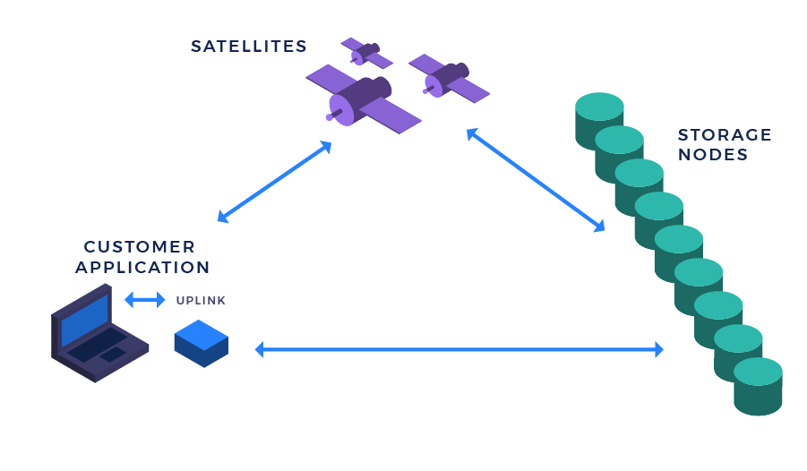

# Storj Test Network

The Storj Test Network allows you to run all of the components of the Storj
system on your local computer.



In every day Storj usage, the Satellite, Storage node, and Uplink are run
separately, but for the test network, all three components are set up and run
in the same process.

We call the test network Captain Planet, or `captplanet` for short, as it
contains all the powers combined of the Satellite, Storage node, and Uplink.

# Installation and configuration

First, you'll need at least [Go 1.11](https://www.golang.org/). Once Go is
installed, you should be able to run:

```bash
go get -u storj.io/storj/cmd/captplanet
```

This will install the `captplanet` binary to wherever Go is configured to
output binaries on your system, by default `~/go/bin`.

Next, run setup:

```bash
~/go/bin/captplanet setup
```

You now have a configured Storj test network with default configuration options.
It's worth it to take a look at `~/.storj/capt/config.yaml` and tweak your
configuration for your desired purposes.

The next step is to run it!

# Running the test network

Captain Planet runs all of the required components of the Storj system. To
start the test network with your configuration, run:

```bash
~/go/bin/captplanet run
```

Your test network is now running. You should see output containing your
Amazon S3 gateway access and secret keys, which you will need to connect
Amazon S3 compatible clients.

Please see the [Uplink CLI](uplink-cli.md) or [S3 Gateway](s3-gateway.md)
tutorial for how to upload and download data to the test network.
